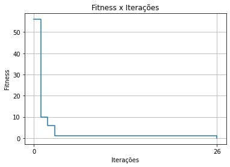
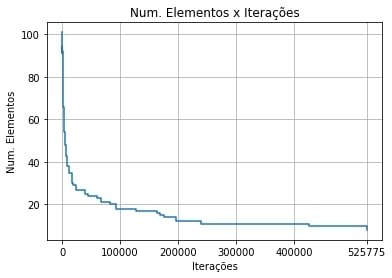

# Subset Sum Problem AG

## :page_with_curl: Sobre o projeto

O projeto tem como objetivo desenvolver um algoritmo genético para resolução do problema da soma do subconjunto - ou *subset sum problem*.

O problema consiste em, dado um conjunto de números inteiros, encontrar um subconjunto cuja soma de seus elementos seja exatamente igual a um valor objetivo definido.

Uma descrição detalhada do problema e um overview sobre sua complexidade em diferentes cenários pode ser vista neste [link](https://en.wikipedia.org/wiki/Subset_sum_problem).

## :computer: Solução implementada

O algoritmo evolutivo é iniciado a partir da geração de um conjunto de inteiros aleatórios, de tamanho previamente definido.

Uma população inicial, ou seja, um conjunto de indivíduos, é então gerada aleatoriamente. Cada indivíduo possui um vetor de *boolean*, de tamanho exatamente igual ao número de elementos no conjunto do problema. Esse vetor representa o cromossomo do indivíduo, e indica se o número daquela posição do conjunto faz parte daquele indivíduo ou não.

Em seguida, o algoritmo vai, essencialmente, seguir um processo iterativo básico de avaliar a população, realizar elitismos, mutações e genocídios com o objetivo de minimizar a diferença entre a soma dos elementos dos invidíduos e a soma alvo. Logo, o *fitness* ótimo do problema é sempre igual a *0*. Além de buscar o melhor *fitness*, o algoritmo também busca diminuir o número de elementos necessários para atingir a soma alvo.

Para evitar valores extremos locais, algumas estratégias foram utilizadas.

### Mutação variável

Foi utilizada uma estratégia de variar a mutação quando o melhor indivíduo se repete por muitas gerações consecutivas. É possível definir no programa o número de repetições necessárias para que a taxa de mutação aumente em 1%, assim como a taxa de mutação inicial.

### Genocídio

Quando a taxa de mutação atinge um máximo de 5%, segundo a estratégia de mutação variável, um genocídio é realizado, mantendo o melhor indivíduo.

## :hammer: Instruções

### Pré-requisitos

* [CMake](https://cmake.org/download/)
* GCC C++11

### Execução

Para execução, clonar o projeto:
```
git clone https://github.com/costaluis/SistemasEvolutivos
```

E, no diretório do projeto, executar os seguintes comandos:
```shell
mkdir build/
cd build
cmake ..
make
./evolutivos
```

Caso deseje alterar algum parâmetro, basta repetir os últimos dois comandos para recompilar e executar novamente.

### Plot dos resultados

Ao final da execução um arquivo é gerado no diretório *files*, com base no nome escolhido no código. Esse arquivo é um .csv que armazena os resultados da evolução do algoritmo.

Para visualização, acesse o arquivo *Plot Resultados.ipynb* e execute todas as células para visualizar três gráficos referentes ao resultado da execução. Exemplos de gráficos:

* Iterações x Fitness x Número de elementos:

<p align="center">
  
</p>

* Iterações x Fitness: 

<p align="center">
  
</p>

* Iterações x Número de elementos: 

<p align="center">
  
</p>


OBS: Verifique se a função *read_csv* tem como parâmetro o caminho relativo para o arquivo de saída do algoritmo evolutivo.

## :movie_camera: Demonstração

O vídeo de demonstração do projeto pode ser visto neste [link](https://drive.google.com/file/d/1UXqG9WiNM0T28HeAbduzPUTczEpH3HHG/view?usp=sharing).

## :busts_in_silhouette: Colaboradores 

<table>
  <tr>
    <td align="center">
      <a href="#">
        <br>
        <sub>
          <b>Luis Fernando</b>
        </sub>
      </a>
    </td>
    <td align="center">
      <a href="#">
        <br>
        <sub>
          <b>João Pedro</b>
        </sub>
      </a>
    </td>
    <td align="center">
      <a href="#">
        <br>
        <sub>
          <b>Leonardo Cerce</b>
        </sub>
      </a>
    </td>
  </tr>
</table>


Alunos | NUSP
-------|------
João Pedro Fidelis Belluzzo | 10716661
Leonardo Cerce Guioto | 10716640
Luis Fernando Costa de Oliveira | 10716532
